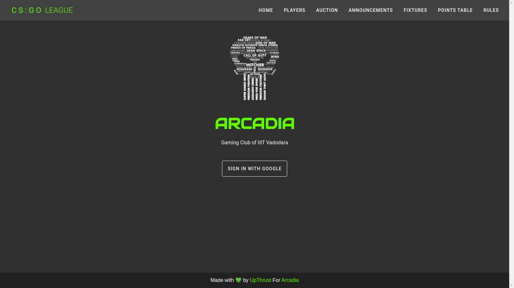
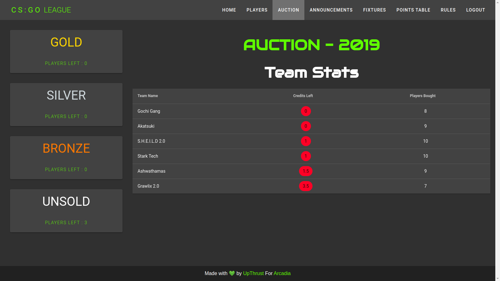
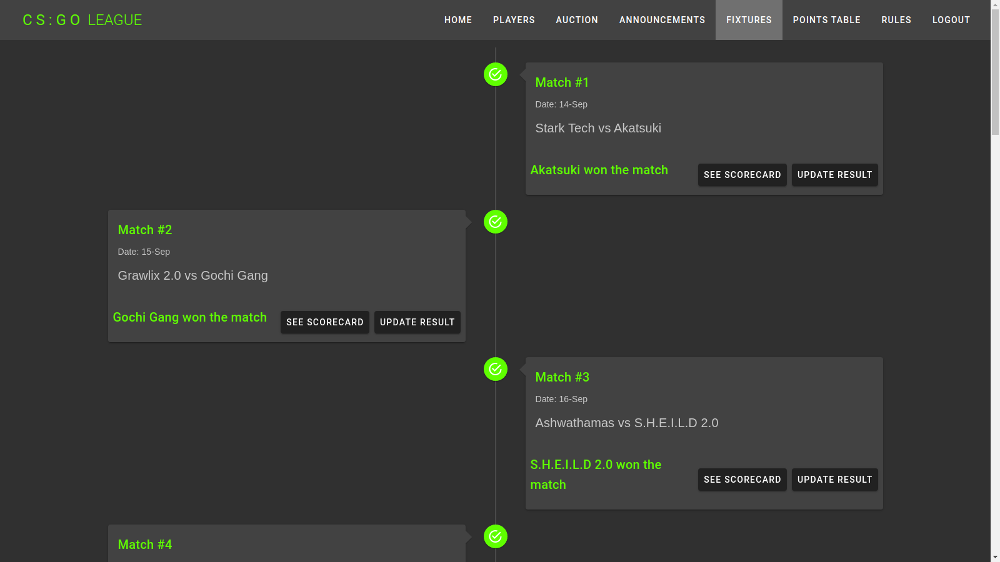
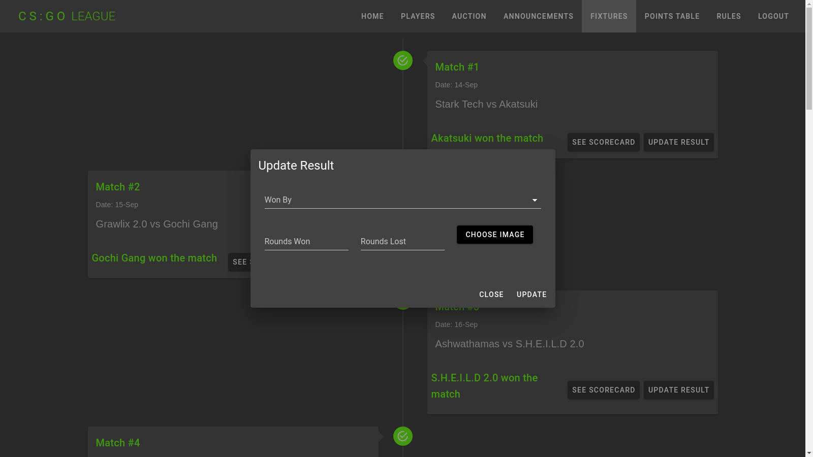
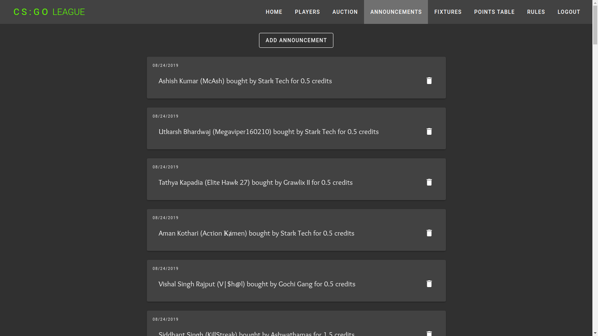

# CS : GO League - ADMIN
<table>
<tr>
<td>
This is the Web application for the ADMIN for CS:GO League organized by ARCADIA - The Gaming Club of IIIT Vadodara. This application is for auctioning the players, making announcements and updating the fixtures of the league.
</td>
</tr>
</table>

## Demo

Click the link to see the working Demo :  https://leagueadmin.web.app/

Click here to see the repo for user's site : https://github.com/VAR-solutions/csgo_league

## Snapshots

The Sign-in is only for the admins. Only after sign-in, other pages can be accessed. For reference, see the snapshots below-

### Landing Page



### Auction Page



### Fixtures Page



### Updating Result of a match



### Announcements Page




## Project setup

- Install the NPM packages
```
npm install
```

- Build and run the project
```
npm run serve
```


## Developers

- [Vishal Gaur](https://github.com/i-vishi)
- [Ravi Varshney](https://github.com/ravivarshney01)
- [Ananya Tewari](https://github.com/antew7)


## Built with 

- [Vue.js](https://vuejs.org/) - An open-source model–view–viewmodel front end JavaScript framework for building user interfaces and single-page applications.
- [Firebase](https://firebase.google.com/) - for NoSQL database and hosting the web application.
- [Vuetify](https://vuetifyjs.com/) - Vue UI Library with beautifully handcrafted Material Components.

<p align="center"> Made with ❤️ by <a href="https://github.com/var-dev">VAR Solutions</a></p>
